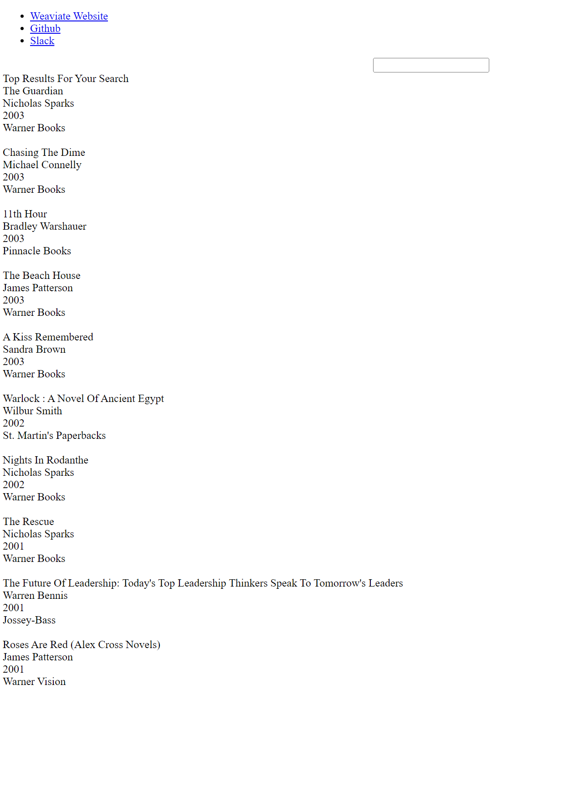

# Book Search Engine
This project involves the creation of a simple tool for doing text-based search over a database of books. 

## Getting Started

### Data
The raw data can be downloaded from [Kaggle](https://www.kaggle.com/datasets/saurabhbagchi/books-dataset). The zip file contains three CSVs--one with information on the books, one with user ratings, and one with user information, all of it pulled from Amazon.

For the purposes of this PoC, I've elected only to use the `books.csv` file.

In the opening lines of `data_processing.py` this file has been loaded and lightly processed to make it suitable for populating the schema (more on this momentarily.)

## Working with Weaviate
Weaviate is an open source ​​vector database and search engine. Vectors are arrays (i.e. lists) of numbers, and they are ubiquitous in machine learning. Computers only operate on numbers, so before an algorithm can be trained to generate captions, answer questions, or translate a language the inputs must be represented mathematically.

The most common way to do this is turn the inputs into vectors. 

For this reason, a SaaS platform which can store and search over vector representation could find applications in domains as far-flung as NLP, protein folding, and image processing.

Fully detailing the process of setting up Weaviate is beyond the scope of this tutorial, but interested parties are referred to their [excellent documentation](https://weaviate.io/developers/weaviate/current/getting-started/index.html). 

To follow along you'll need to install Weaviate's command line tools and figure out how to run Weaviate locally off a Docker image. The rest is detailed below.

## Defining the Schema

The `data_processing.py` file accomplishes three things: processing the input data so it'll fit snugly into a schema, defining that schema, and then populating that schema.

The first of these is discussed in the `Data` section above, and it is to the other steps that we now turn. 

A schema is a logical 'description' of the data an application can expect to send and receive, along with its properties and relationships.

Just as there is a protocol for picking up packages, loading them in a truck, and depositing them at their destination, there is a protocol for loading data, transporting it across a network, and depositing it at its destination. 

A warehouse wouldn't let you drop boxes off any way you want to, and neither will an application. 

A schema is not the entire protocol, but it's an important part. It says, "When I send you a packet of data you can expect it to be shaped like this and to contain these pieces of information, and I expect the same when you send me a packet of data."

Not unlike vectors, schemas are everywhere. They are particularly important in databases, and as a vector database, Weaviate is no exception. 

After the data processing is finished, the following bit of code checks to see if our schema already exists and deletes it if does:

```
current_schemas = client.schema.get()['classes']
for schema in current_schemas:
    if schema['class']=='Book':
        client.schema.delete_class('Book')
```

This is useful because once you've defined a schema you can't define another one with the same name. That means if you define a schema, correct a typo, and then run your code again, it'll throw an error unless you have this code snippet in your file. 

The actual schema is defined with a JSON notation:

```book_class_schema = {
    "class": "Book",
    "description": "A collection of books with title, author, year of publication, and publisher",
    "properties": [
        {
            "name": "book_title",
            "dataType": ["string"],
            "description": "The title of the book", 
        },
        {
            "name": "book_author",
            "dataType": ["string"],
            "description": "The author of the book", 
        },        
        {
            "name": "year_of_publication",
            "dataType": ["string"],
            "description": "The year in which the book was published", 
        },
        {
            "name": "publisher",
            "dataType": ["string"],
            "description": "The publisher of the book", 
        }
    ]
}
```

The naming convention here is pretty intuitive. The `class` is what we call the schema throughout the rest of the code, each of the properties are properties of the underlying data, the `dataType` is the type of data contained in each property, and so on. 

The following line, `client.schema.create_class(book_class_schema)`, actually creates the schema. Once this is executed we have the schema, but it does not yet contain any data. 

The `for` loop on line 65 is where the magic happens. We've loaded and pre-processed our data, and now we're essentially 'uploading' the formatted data into the schema.

It's easy to grasp the steps involved here by analogizing them to building a library. First, we have to create plans for the library, covering where the shelves go, how many bathrooms there are, etc. Then, we'd pass those plans to a construction firm that would actually build the structure. Then, we'd fill the empty shelves with books. 

Defining the schema in JSON on line `27` is like creating the plans, creating the schema with `client.schema.create_class(book_class_schema)` is like building the library, and the `for` loop on line 65 is line walking in with boxes of books and putting them on the shelves.  

### Querying the schema

So having filled our metaphorical library with data, how do we go about accessing it?

The answer is simple: we use queries. 

As its name implies, a query is a request for information--and since we're talking about computers, those requests have to be structured in a certain way.

In this PoC, we use GraphQL to query our book database. GraphQL is an open-source tool for interacting with APIs that was developed by Facebook. 

GraphQL has a JSON-like structure, and in the `query.js` file you can find our query (wrapped in some javascript so another file can later call it and display it on a webpage):

```
async function get_filtered_results(text){
    let data = await client.graphql
        .get()
        .withClassName('Book')
        .withSort([{ path: ['year_of_publication'], order: 'desc' }])
        .withFields(['book_title', 'book_author', 'year_of_publication', 'publisher'])
        .withWhere({
            operator: 'Or',
            operands: [{
                path: ["book_title"],
                operator: "Like",
                valueString: "*" + text + "*"
            },
            {
                path: ["book_author"],
                operator: "Like",
                valueString: "*" + text + "*"
            },
            {
                path: ["year_of_publication"],
                operator: "Like",
                valueString: "*" + text + "*"
            }
                ,
            {
                path: ["publisher"],
                operator: "Like",
                valueString: "*" + text + "*"
            }]
        })
        .withLimit(10)
        .do()
        .then(info => {
            return info
        })
        .catch(err => {
            console.error(err)
        })
        // console.log(data)
    return data;
}
```

This function takes a search string and uses it to search over the database via the `client.graphql` functionality. As before, I think if you read this code slowly you should be able to puzzle out what each part of it does based on its name, even with little coding experience. 

For example, `.withSort()` sorts our results on a certain value (`'year_of_publication']`) and in a certain way (`'desc'` means 'descending).

`.withWhere()` gives us considerable power in modulating how our search is performed. If you remember college math, the `Or` operator is permissive, and we could tighten it up by using `And` instead. Because we've included all the properties in our schema (title, author, publication year, and publisher), the search string will match on all those fields, and if we only wanted to search on the title we could remove the other fields. 

The final line in this file is `module.exports = { get_filtered_results }`, and it's important. It makes this function available for the next file, `index.js`. 

### Defining a lightweight app and webpage.

In `index.js`, we're essentially using javascript to define a super-simple application. 

After importing some libraries, we import the function from `query.js` on line 14.

The first `app.get` statement on line 27 renders what we're actually going to see in the browser by referencing the information defined in `search.ejs`. It'll pass whatever is in `book_info` to the `search.ejs` file, which will then display it according to our specifications. 

On line 34 we accept a search string, on line 35 we pass it to the `get_filtered_results` function, then we get the results and pass them (as `book_info`) to `search.ejs`.

Finally, on the last lines we tell the app which port to listen on. I've used port 3000, but others can work as well. 

`search.ejs` contains a lot of HTML and a smattering of javascript which renders the contents of `book_info`. I think a tutorial on HTML would take us too far afield, you need only understand that this gathers the contents of `book_info` from the function in `index.js` and then offers instructions for the browser as to how to display the results.

### Summary and conclusion.

Let's pause for a moment and recap. In `data_processing.py` we pulled in a books dataset and did some basic pre-processing on it, then we defined, created, and populated the schema. In `query.js` we defined a GraphQL query which would let us ask this schema for information, and we exported the function so that `index.js` could access it. In `index.js` we set up a lightweight application that could use the query in `query.js` to get data from the schema and pass it to `search.ejs`, which renders the result in a webpage. 

What comes out of all this is a simple web-based application which can take a search string and return any book record containing that string in any of its fields.

Here are the results for the string 'war':



Here are the results for the string 'love':

[Love results](views/love.png)

